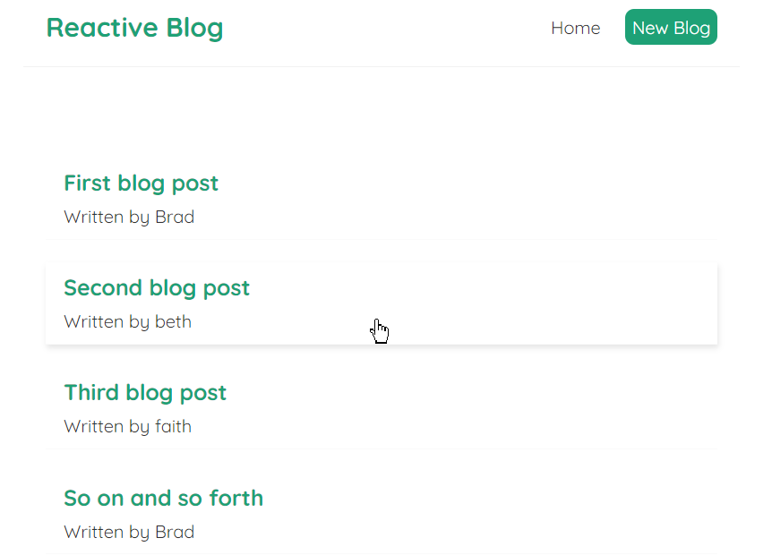
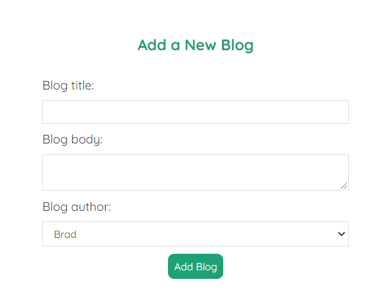
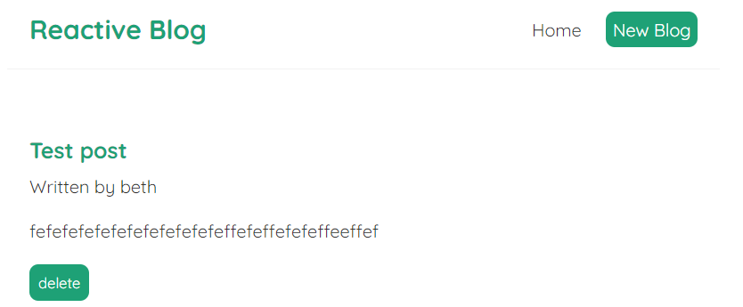

# react-blog





## Installation

```bash
npm install
```

## Usage
This project uses json-server. In order to get server running you need to write this to the terminal:

```bash
npx json-server --watch data/db.json --port 8000
```
If you have something else running on port 8000 then you should choose different port number.

Open a new terminal and run this

```bash
npm start
```
